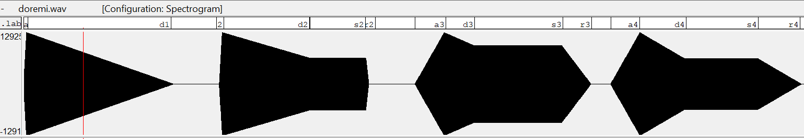
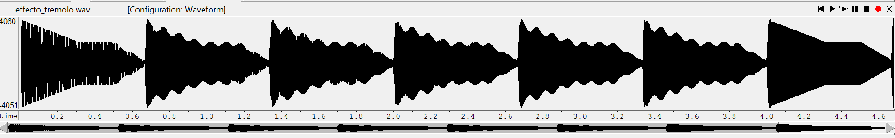
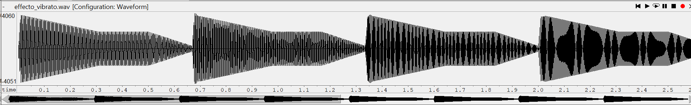
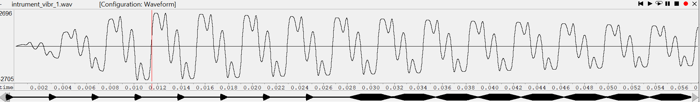
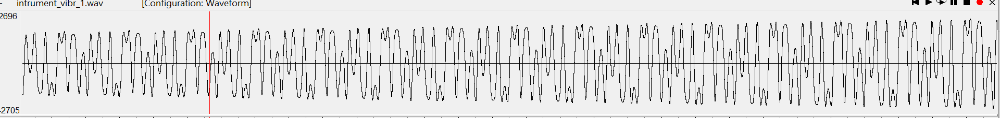
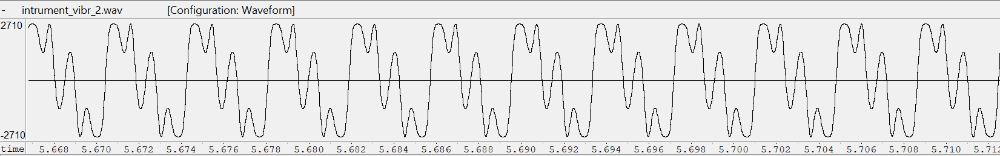
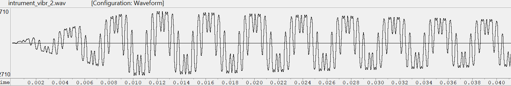

PAV - P5: síntesis musical polifónica
=====================================

Obtenga su copia del repositorio de la práctica accediendo a [Práctica 5](https://github.com/albino-pav/P5) 
y pulsando sobre el botón `Fork` situado en la esquina superior derecha. A continuación, siga las
instrucciones de la [Práctica 2](https://github.com/albino-pav/P2) para crear una rama con el apellido de
los integrantes del grupo de prácticas, dar de alta al resto de integrantes como colaboradores del proyecto
y crear la copias locales del repositorio.

Como entrega deberá realizar un *pull request* con el contenido de su copia del repositorio. Recuerde que
los ficheros entregados deberán estar en condiciones de ser ejecutados con sólo ejecutar:

~~~~~~~~~~~~~~~~~~~~~~~~~~~~~~~~~~~~~~~~~~~~~~~~~~~~~.sh
  make release
~~~~~~~~~~~~~~~~~~~~~~~~~~~~~~~~~~~~~~~~~~~~~~~~~~~~~

A modo de memoria de la práctica, complete, en este mismo documento y usando el formato *markdown*, los
ejercicios indicados.

Ejercicios.
-----------

### Envolvente ADSR.

Tomando como modelo un instrumento sencillo (puede usar el InstrumentDumb), genere cuatro instrumentos que
permitan visualizar el funcionamiento de la curva ADSR.

* Un instrumento con una envolvente ADSR genérica, para el que se aprecie con claridad cada uno de sus
  parámetros: ataque (A), caída (D), mantenimiento (S) y liberación (R).
* Un instrumento *percusivo*, como una guitarra o un piano, en el que el sonido tenga un ataque rápido, no
  haya mantenimiemto y el sonido se apague lentamente.
  - Para un instrumento de este tipo, tenemos dos situaciones posibles:
    * El intérprete mantiene la nota *pulsada* hasta su completa extinción.
    * El intérprete da por finalizada la nota antes de su completa extinción, iniciándose una disminución
	  abrupta del sonido hasta su finalización.
  - Debera representar en esta memoria **ambos** posibles finales de la nota.
* Un instrumento *plano*, como los de cuerdas frotadas (violines y semejantes) o algunos de viento. En
  ellos, el ataque es relativamente rápido hasta alcanzar el nivel de mantenimiento (sin sobrecarga), y la
  liberación también es bastante rápida.

Para los cuatro casos, deberá incluir una gráfica en la que se visualice claramente la curva ADSR. Deberá
añadir la información necesaria para su correcta interpretación, aunque esa información puede reducirse a
colocar etiquetas y títulos adecuados en la propia gráfica (se valorará positivamente esta alternativa).

  La primera y la segunda curva ADSR corresponden a un instrumento percusivo, la primera del tipo 1 y la segunda del tipo 2, la tecera corresponde a un instrumento de cuerda frotada como el violin y la última corresponde a un instrumento con una envolvente ADSR genérica.
  
   

### Instrumentos Dumb y Seno.

Implemente el instrumento `Seno` tomando como modelo el `InstrumentDumb`. La señal **deberá** formarse
mediante búsqueda de los valores en una tabla.

- Incluya, a continuación, el código del fichero `seno.cpp` con los métodos de la clase Seno.
    
    ```c
    Seno::Seno(const std::string &param) : adsr(SamplingRate, param) {
      bActive = false;
      x.resize(BSIZE);

      KeyValue kv(param);
      int N;
      if (!kv.to_int("N",N))
        N = 40; //default value
  
      tbl.resize(N);
      float phase = 0, step = 2 * M_PI /(float) N;
      index = 0;
      for (int i=0; i < N ; ++i) {
        tbl[i] = sin(phase);
        phase += step;
      }
    }
    void Seno::command(long cmd, long note, long vel) {
      if (cmd == 9) {		//'Key' pressed: attack begins
        bActive = true;
        adsr.start();
        phase = 0;
        float F0=440.0*pow(2,(((float)note-69.0)/12.0))/SamplingRate; 
        A=vel/128.0;
        step=2*M_PI*F0;
      }
      else if(cmd==0 || cmd==8){
        adsr.stop();
      }
    }
    const vector<float> & Seno::synthesize() {
      if (not adsr.active()) {
        x.assign(x.size(), 0);
        bActive = false;
        return x;
      }   
      else if (not bActive)
        return x;
      for (unsigned int i=0; i<x.size(); ++i) {
        x[i] = 0.3*A*sin(phase);
        phase = phase + step;
        while(phase>2*M_PI)
          phase = phase - 2*M_PI;
      }
      adsr(x); //apply envelope to x and update internal status of ADSR
      return x;
    }
  ```

- Explique qué método se ha seguido para asignar un valor a la señal a partir de los contenidos en la tabla,
  e incluya una gráfica en la que se vean claramente (use pelotitas en lugar de líneas) los valores de la
  tabla y los de la señal generada.

  En la tabla hemos introducido los valores de un periodo de señal, a partir de la longitud de la tabla, N, hemos ido almacenando en primer lugar el sen(0) y a continuación en cada posición de la tabla hasta llegar a N, le hemos ido sumando al argumento del seno 2*Pi/N , haciendo asi que el último valor almacenado en la tabla sea sen(N * 2*Pi/N)= sen(2*Pi)=sen(0), que corresponde a un periodo de la señal.

  Para crear el instrumento Seno necesitamos que la fase del seno empiece por 0, como anteriormente hemos explicado, pero a esta le iremos sumando, en vez de 2*Pi/N , 2*Pi*F0, donde F0 se halla de la siguiente formula : Note=69+12·log2(f0/440) teniendo en cuenta la periodo de muestreo. Por lo que al crear la señal lo que hacemos es ajustar la amplitud, mediante la velocidad indicada usando como
  valor máximo 128, multiplicada por el seno(phase) donde esta phase se irá incrementando como se indica anteriormente. No hemos podido usar la tabla ya que al usar la frecuencia fundamental, se accede a indices que no hay en la tabla, y hemos solucionado este problema de la manera explicada.

- Si ha implementado la síntesis por tabla almacenada en fichero externo, incluya a continuación el código
  del método `command()`.

### Efectos sonoros.

- Incluya dos gráficas en las que se vean, claramente, el efecto del trémolo y el vibrato sobre una señal
  sinusoidal. Deberá explicar detalladamente cómo se manifiestan los parámetros del efecto (frecuencia e
  índice de modulación) en la señal generada (se valorará que la explicación esté contenida en las propias
  gráficas, sin necesidad de *literatura*).

    Como podemos observar en la siguiente imagen, se ha aplicado un tremolo. El tremolo es la variación de la amplitud de la señal. Esta variación coge forma de una sinusoide, con una frecuencia de variación y un índice que determina qué tanto por ciento de la amplitud varia. ( en la primera y última nota no se ha aplicado el efecto para poder ver la diferencia )

   


  En la siguiente imagen, observamos una señal a la que se ha aplicado un vibrato. El vibrato es una rápida variación del tono en la duración de una nota que se consigue modulando en frecuencia la señal de audio.

   
   
- Si ha generado algún efecto por su cuenta, explique en qué consiste, cómo lo ha implementado y qué
  resultado ha producido. Incluya, en el directorio `work/ejemplos`, los ficheros necesarios para apreciar
  el efecto, e indique, a continuación, la orden necesaria para generar los ficheros de audio usando el
  programa `synth`.

### Síntesis FM.

Construya un instrumento de síntesis FM, según las explicaciones contenidas en el enunciado y el artículo
de [John M. Chowning](https://ccrma.stanford.edu/sites/default/files/user/jc/fm_synthesispaper-2.pdf). El
instrumento usará como parámetros **básicos** los números `N1` y `N2`, y el índice de modulación `I`, que
deberá venir expresado en semitonos.

- Use el instrumento para generar un vibrato de *parámetros razonables* e incluya una gráfica en la que se
  vea, claramente, la correspondencia entre los valores `N1`, `N2` e `I` con la señal obtenida.

    A continuación observamos dos trozos de señal de audio creadas a partir de los mismos paráteros N1 y N2 pero con diferente I. La primera imagen tenemos una I menor que en la segunda.
       
      

    Ahora vamos a modificar N2, por lo que aumenta fm y por tanto el vibrato.
         
         
        
- Use el instrumento para generar un sonido tipo clarinete y otro tipo campana. Tome los parámetros del
  sonido (N1, N2 e I) y de la envolvente ADSR del citado artículo. Con estos sonidos, genere sendas escalas
  diatónicas (fichero `doremi.sco`) y ponga el resultado en los ficheros `work/doremi/clarinete.wav` y
  `work/doremi/campana.work`.
        
    Los valores tomados para el clarinete son: I= 0.75 , N1=3  , N2=1 .
    Para la campana: I= 0.75 , N1= 1 , N2=1.4 .
  * También puede colgar en el directorio work/doremi otras escalas usando sonidos *interesantes*. Por
    ejemplo, violines, pianos, percusiones, espadas láser de la
	[Guerra de las Galaxias](https://www.starwars.com/), etc.

### Orquestación usando el programa synth.

Use el programa `synth` para generar canciones a partir de su partitura MIDI. Como mínimo, deberá incluir la
*orquestación* de la canción *You've got a friend in me* (fichero `ToyStory_A_Friend_in_me.sco`) del genial
[Randy Newman](https://open.spotify.com/artist/3HQyFCFFfJO3KKBlUfZsyW/about).

- En este triste arreglo, la pista 1 corresponde al instrumento solista (puede ser un piano, flautas,
  violines, etc.), y la 2 al bajo (bajo eléctrico, contrabajo, tuba, etc.).
- Coloque el resultado, junto con los ficheros necesarios para generarlo, en el directorio `work/music`.
- Indique, a continuación, la orden necesaria para generar la señal (suponiendo que todos los archivos
  necesarios están en directorio indicado).
  
  La orden necesaria para generar la señal de ToyStory es:    
  synth ToyStory.orc ToyStory_A_Friend_in_me.sco ToyStory.wav

También puede orquestar otros temas más complejos, como la banda sonora de *Hawaii5-0* o el villacinco de
John Lennon *Happy Xmas (War Is Over)* (fichero `The_Christmas_Song_Lennon.sco`), o cualquier otra canción
de su agrado o composición. Se valorará la riqueza instrumental, su modelado y el resultado final.
- Coloque los ficheros generados, junto a sus ficheros `score`, `instruments` y `efffects`, en el directorio
  `work/music`.
- Indique, a continuación, la orden necesaria para generar cada una de las señales usando los distintos
  ficheros.

  Hemos creado la banda sonora de "Titanic" a partir de unos instrumentos genererados a partir del instrumento seno y la orden para realizar la ejecución es la siguiente:
  
  synth Titanic.orc Titanic.sco Titanic.wav

